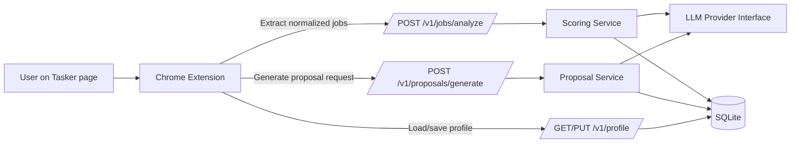

# ARCHITECTURE

## Overview
Tasker Proposal Copilot uses a simple local-first two-part architecture:
1. **Chrome Extension (MV3)** — page interaction + UX
2. **Local FastAPI Service** — profile, scoring, LLM abstraction, proposal generation

## Components

## 1) Extension (`apps/extension`)
- **background/service worker**: mediates popup ↔ content script and backend API calls.
- **content script**: Tasker DOM parsing, in-page form filling, robust fallback handling.
- **popup UI**: actions and results (analyze jobs, generate proposal, edit draft, fill form).
- **Tasker adapter**: centralized selectors and parsing logic.

### Safety in Extension
- Fill action updates fields only.
- No submit click, no submit event dispatch.
- Warning banner shown after form fill.

## 2) API (`apps/api`)
- FastAPI app with versioned routes (`/v1`).
- SQLite storage for profile and lightweight logs.
- Services:
  - `ScoringService`: explainable rule scoring + optional LLM note.
  - `ProposalService`: proposal draft synthesis from profile + job.
  - `LLMClient`: provider interface with deterministic fallback.

## 3) Shared package (`packages/shared`)
- TypeScript schemas and constants used by extension.
- Mirrors API data contracts for strong typing.

## Data Contracts (MVP)
- `UserProfile`
- `NormalizedJob`
- `AnalyzeJobsRequest/Response`
- `GenerateProposalRequest/Response`

## API Endpoints
- `GET /health`
- `GET /v1/profile`
- `PUT /v1/profile`
- `POST /v1/jobs/analyze`
- `POST /v1/proposals/generate`

## Scoring Strategy
- Weighted transparent heuristics (category, budget, keywords, blacklist, recency).
- Returns reason strings and red flags.
- Optional LLM analysis appended when configured.

## Proposal Strategy
- Template-driven baseline for reliability.
- Optional LLM rewrite for style/tone improvements.
- Always produce concise, editable output.

## Reliability & Observability
- Graceful parse failures with user-visible errors.
- Basic debug logs on both extension and API.
- Deterministic fallback if LLM unavailable.

## Security
- Local development by default.
- Secrets from env only.
- No credential hardcoding.

## Future Evolution (post-MVP)
- Better semantic matching embeddings.
- Profile variants per service type.
- Multi-platform adapters beyond Tasker.
