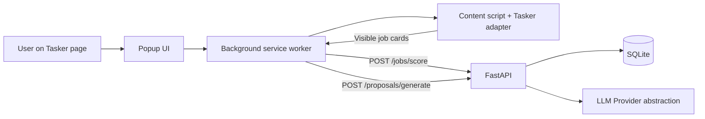

# ARCHITECTURE

## Overview
Tasker Proposal Copilot is a two-process local-first system:
1. **Chrome Extension (MV3)** for Tasker page interaction and UX.
2. **FastAPI backend** for profile persistence, scoring, and proposal generation.

## Clear responsibility split

### Extension (`apps/extension`)
- **Content script**: parse Tasker DOM and fill proposal fields safely.
- **Tasker adapter module**: single source of truth for selectors and normalization logic.
- **Background worker**: message orchestration + API client calls.
- **Popup UI**: user controls and scored recommendation rendering.

### Backend (`apps/api`)
- Exposes REST API.
- Stores profile/opportunities/proposal drafts in SQLite.
- Runs deterministic, explainable scoring logic.
- Generates proposal drafts.
- Uses provider abstraction so LLM is optional.

### Shared package (`packages/shared`)
- Shared TypeScript contracts consumed by extension.

## API surface (MVP)
Primary endpoints:
- `GET /health`
- `GET /profiles/current`
- `PUT /profiles/current`
- `POST /jobs/score`
- `POST /proposals/generate`

Compatibility aliases remain under `/v1/*` for existing clients.

## Backend data persistence
SQLite tables:
- `UserProfileRecord` (single current profile payload)
- `OpportunityRecord` (scored job snapshots)
- `ProposalDraftRecord` (generated drafts)

## LLM provider design
- `LLMProvider` protocol defines `summarize_fit`.
- `MockLLMProvider` is default for local/offline deterministic development.
- `OpenAICompatibleProvider` placeholder is used when `ENABLE_LLM=true` and API key exists.

## Reliability and safety
- Errors are surfaced to popup status for user action.
- Parsing logic is isolated from API orchestration.
- Form fill never submits; user must manually review and submit.
- No anti-bot or stealth behavior is implemented.

## Tasker assumptions and limitations
- Targets Tasker cases/listing flows first.
- Selector drift is expected; adapter can be updated independently.
- MVP parses only visible cards; does not auto-scroll or crawl hidden pages.
