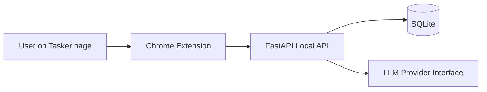

# Tasker Proposal Copilot (MVP)

Open-source AI copilot for **Tasker (Taiwan freelance marketplace)** proposal workflows.

## Why this exists
Freelancers lose time repeatedly scanning listings and rewriting similar proposals. This project focuses on one vertical workflow:
1. Analyze job listings quickly
2. Rank fit with transparent reasons
3. Generate tailored proposal drafts
4. Fill proposal forms safely (manual final submit)

## MVP Features
- Chrome Extension (MV3) on Tasker pages
- Parse Tasker listing cards and job detail content
- Local FastAPI backend scoring and proposal APIs
- Explainable scoring (rules + optional LLM notes)
- Editable proposal generation
- Fill-form helper that **stops before final submission**

## Architecture diagram


## Repo layout
- `apps/extension` - TypeScript Chrome extension
- `apps/api` - FastAPI backend + SQLite
- `packages/shared` - shared TS contracts
- `docs/` - design notes and guides
- `scripts/` - helper scripts
- `.github/workflows/` - CI

## Local setup
### Prerequisites
- Node.js 20+
- Python 3.11+

### 1) Backend
```bash
cd apps/api
python -m venv .venv
source .venv/bin/activate
pip install -e .[dev]
cp ../../.env.example .env
uvicorn app.main:app --reload --port 8000
```

### 2) Shared package
```bash
cd packages/shared
npm install
npm run build
```

### 3) Extension
```bash
cd apps/extension
npm install
npm run build
```

## Environment variables
Copy `.env.example` and update as needed.

Key variables:
- `API_HOST` (default `127.0.0.1`)
- `API_PORT` (default `8000`)
- `OPENAI_API_KEY` (optional)
- `OPENAI_BASE_URL` (optional, OpenAI-compatible)
- `OPENAI_MODEL` (default `gpt-4o-mini`)
- `ENABLE_LLM` (`true`/`false`)

## Load extension in Chrome
1. Open `chrome://extensions`
2. Enable **Developer mode**
3. Click **Load unpacked**
4. Select `apps/extension/dist`
5. Open Tasker cases page and use popup actions

## Safety and limitations
- This project does **not** auto-submit proposals.
- User must manually review and click final submit.
- No anti-bot/CAPTCHA bypass features are included.
- You are responsible for complying with Tasker terms and local laws.

## Development commands
```bash
# API
cd apps/api
ruff check .
black --check .
pytest

# Extension
cd apps/extension
npm run lint
npm run typecheck

# Shared
cd packages/shared
npm test
```

## CI
GitHub Actions runs lint + tests for API, extension, and shared packages on push/PR.

## Roadmap
- Better ranking via embeddings
- Configurable profile presets
- Improved Tasker selector resilience
- Enhanced UI + result explanation views
- Multi-platform adapters (post-v1)

## Screenshots
> Placeholder: add screenshots/gifs of Analyze → Generate → Fill flow.

## Contribution guide
- Start with [CONTRIBUTING.md](./CONTRIBUTING.md).
- Reference [PRODUCT_SPEC.md](./PRODUCT_SPEC.md), [ARCHITECTURE.md](./ARCHITECTURE.md), and [AGENTS.md](./AGENTS.md).
- Security reports: [SECURITY.md](./SECURITY.md).

## License
MIT
